# Deep Model-Based Super-Resolution with Non-uniform Blur

This repository implements the code of *Deep Model-Based Super-Resolution with Non-uniform Blur*

# Train

To train the code please first download COCO dataset available at: https://cocodataset.org.

```
python main_train.py -opt options/train_nimbusr.json
```

# Test

Pre-trained model is available at: *model_zoo/NIMBUSR.pth*

See *test.ipynb* to test the model on COCO dataset.

# Results

We achieve state-of-the-art results in super-resolution in the presence of spatially-varying blur.
Here are some of the results we obtained. Feel free to test on your own sample using the testing notebook.

LR | SwinIR           |  BlindSR | USRNet | Ours | HR 
:-:|:------------------:|:-------:|:---:|:------:|:----:
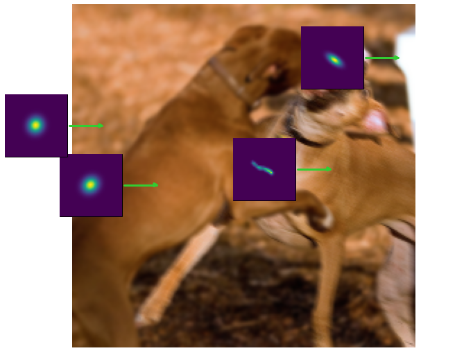  |  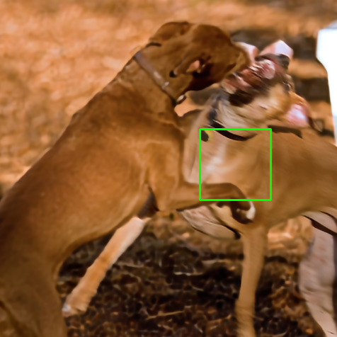 |   | 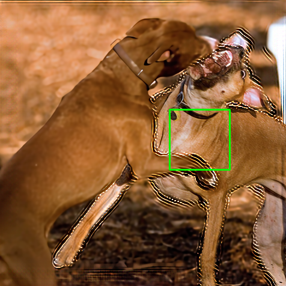  |   | 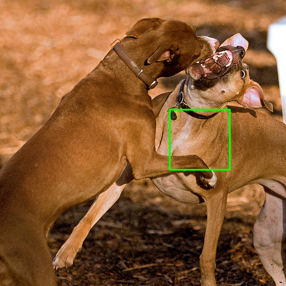
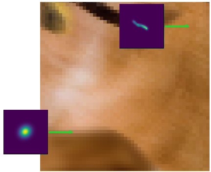  |  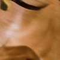 | 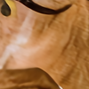  | 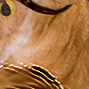  | 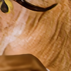  | 
  |  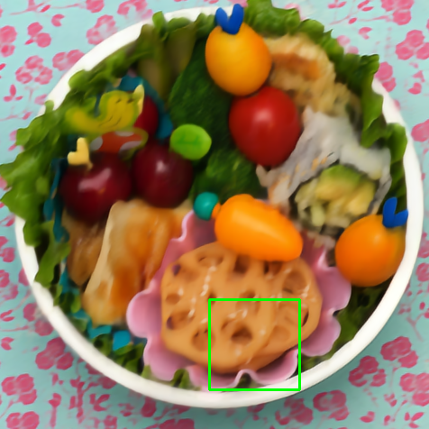 |   | 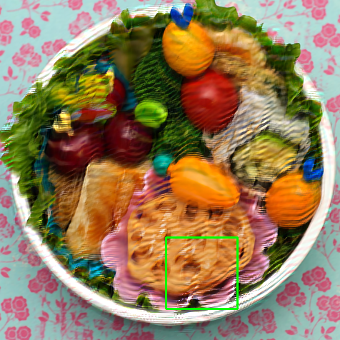  | 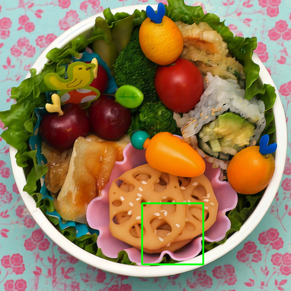  | 
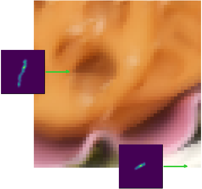  |   |   | 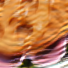  | 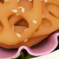  | 
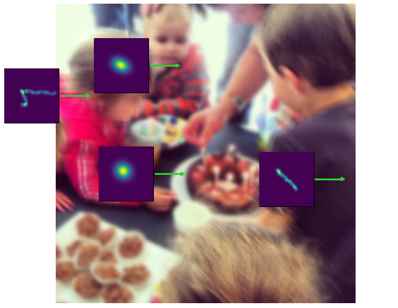  |   |   | 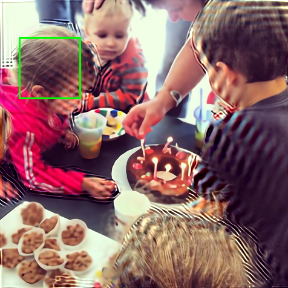  |   | 
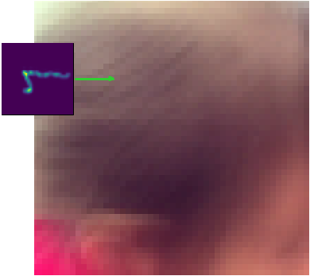  |  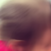 |   |   |   | 

LR | SwinIR           |  BlindSR | USRNet | Ours  
:-:|:------------------:|:-------:|:---:|:------:
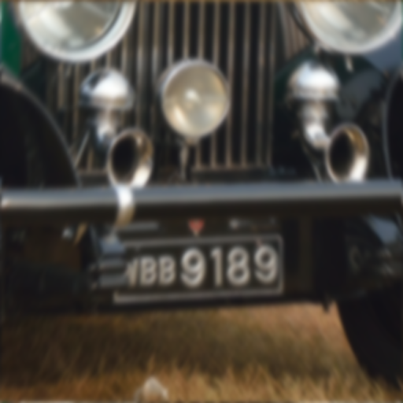  |   | 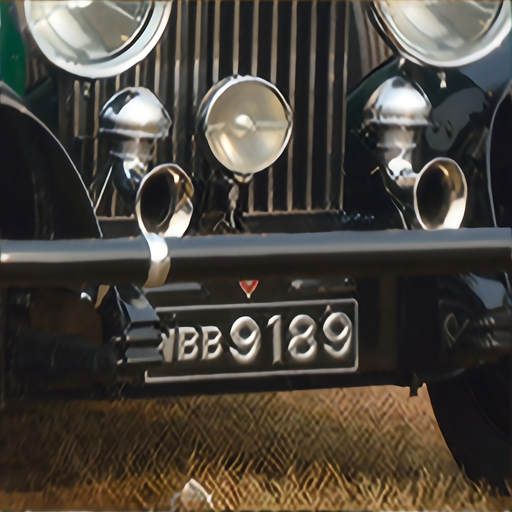  | 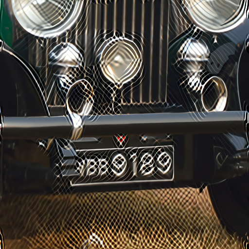  |   
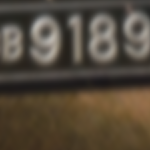  |  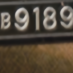 |   | 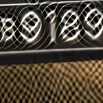  | 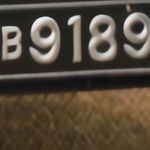  


# Acknowledgement
The codes use [KAIR](https://github.com/cszn/KAIR) as base. Please also follow their licenses. I would like to thank them for the amazing repository.